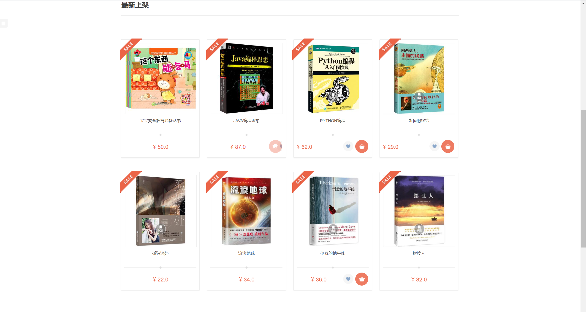
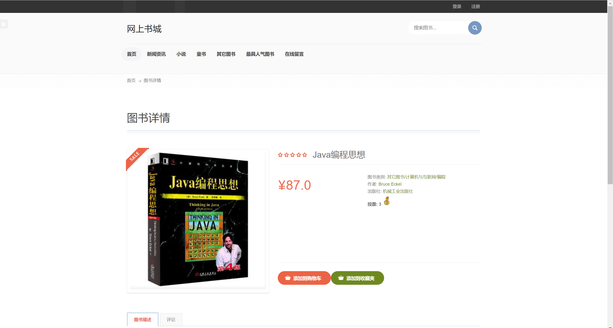
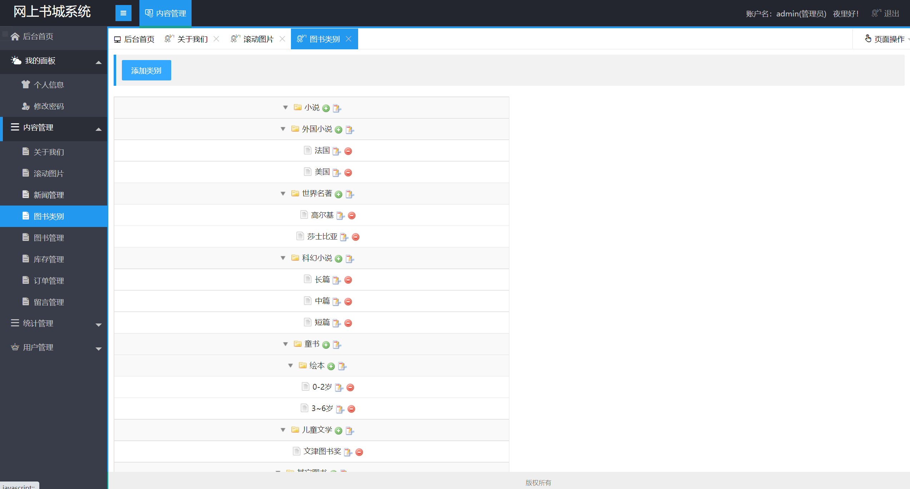
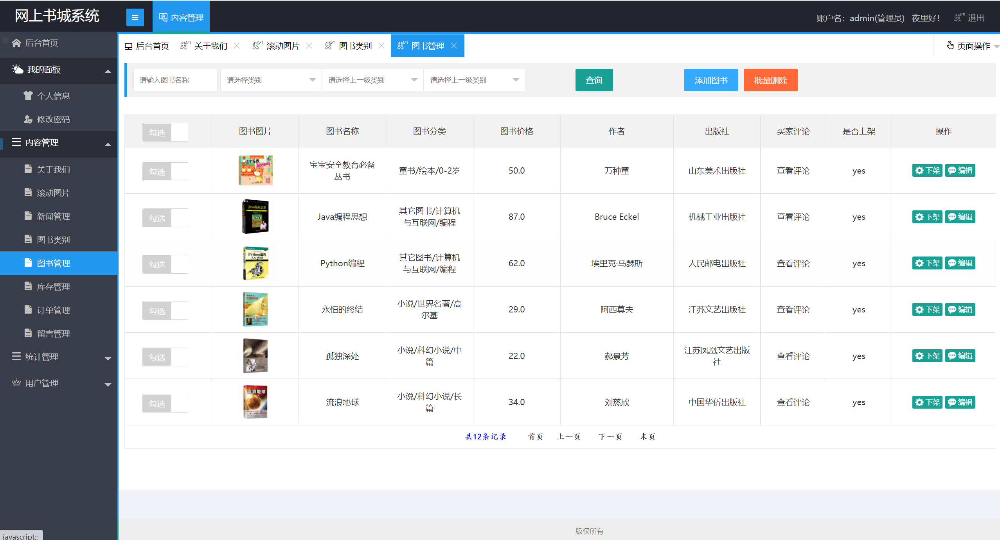
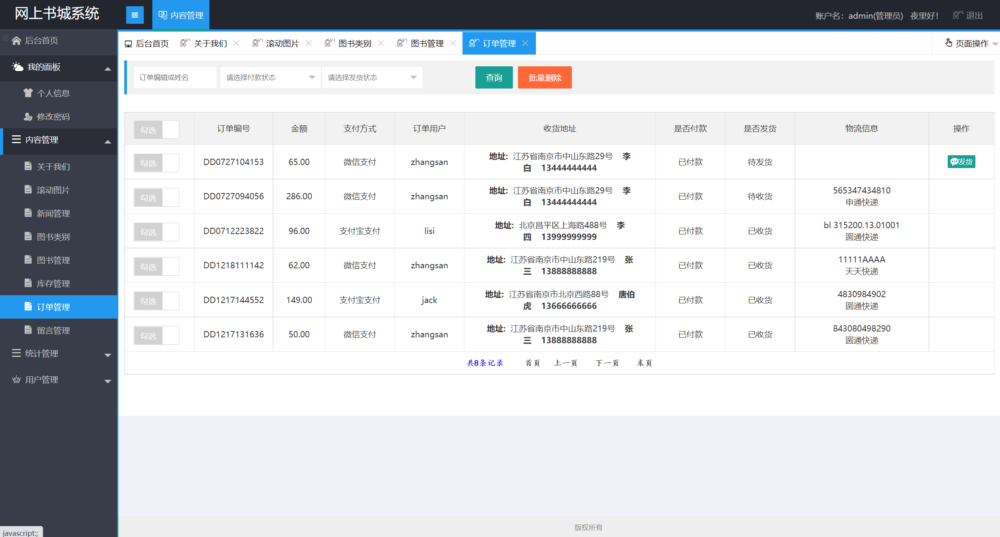
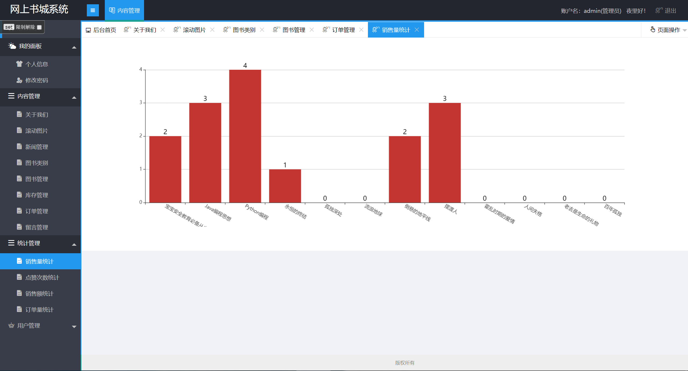
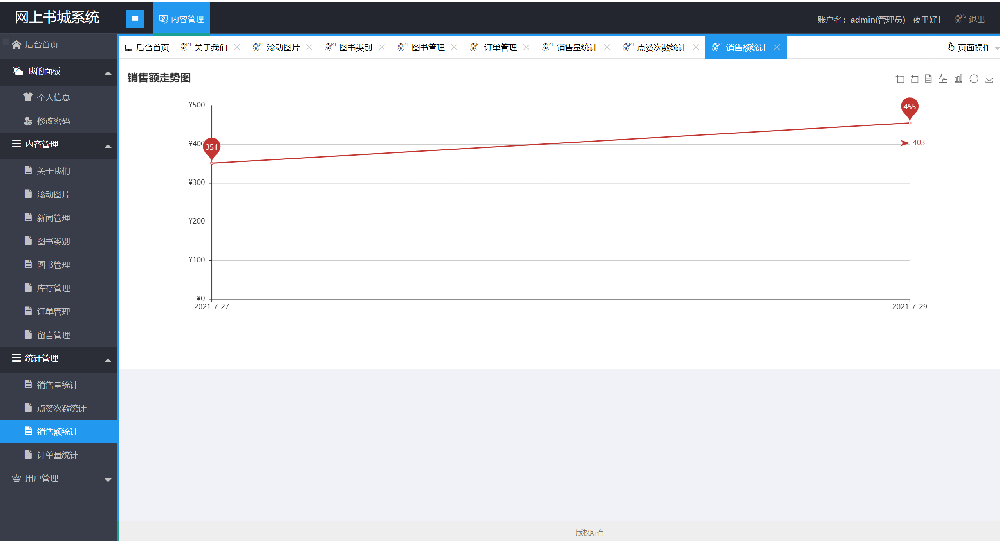

## 基于SSM框架的网上书城系统

- <b>完整代码获取地址：从戎源码网 ([https://armycodes.com/](https://armycodes.com/))</b>
- <b>技术探讨、资料分享，请加QQ群：692619798</b> 
- <b>作者微信：19941326836  QQ：952045282</b> 
- <b>承接计算机毕业设计、Java毕业设计、Python毕业设计、深度学习、机器学习</b>
- <b>选题+开题报告+任务书+程序定制+安装调试+论文+答辩ppt 一条龙服务</b>
- <b>所有选题地址 ([https://github.com/YuLin-Coder/AllProjectCatalog](https://github.com/YuLin-Coder/AllProjectCatalog)) </b>

## 项目介绍
基于SSM框架的网上书城系统，系统分为用户和管理员两个角色，主要功能如下
1.前台功能模块
首页、新闻资讯、图书列表、图书分类、图书搜索、图书详情、图书投票、在线留言、添加到购物车、添加到收藏夹、用户登录、用户注册、个人中心、收货地址管理、购买图书、下单、结算付款、查看订单信息等功能

2.后台功能模块
新闻管理、图书管理、图书类别管理、订单管理、库存管理、留言管理、内容管理、用户管理、销售量统计、销售额统计、订单量统计、个人信息修改等功能

## 项目技术
- 编程语言：Java
- 数据库：MySQL
- 前端技术：JSP、jQuery 、LayUI
- 后端技术：Spring、SpringMVC、MyBatis

## 运行环境
- JDK版本：JDK1.8及以上
- 开发工具：IDEA、Ecplise、Myecplise都可以
- 数据库: MySQL5.7及以上

## 运行截图

